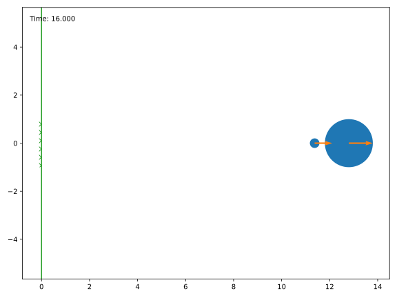

# billiards

> A 2D physics engine for simulating dynamical billiards

**billiards** is a python library that implements a very simple physics engine:
It simulates the movement and elastic collisions of hard, disk-shaped particles in a two-dimensional world.


## Features

- Collisions are found and resolved *exactly*. No reliance on time steps, no tunneling of high-speed bullets!
- Quick state updates thanks to [numpy](https://numpy.org), especially if there are no collisions between the given start and end times.
- Static obstacles to construct a proper billiard table.
- Balls with zero radii behave like point particles, useful for simulating [dynamical billiards](https://en.wikipedia.org/wiki/Dynamical_billiards) (although this library is not optimized for point particles).
- Optional features: plotting and animation with [matplotlib](https://matplotlib.org), interaction with [pyglet](http://pyglet.org).
- Free software: GPLv3+ license.


## Installation

**billiards** depends on [numpy](https://numpy.org).
Additionally, billiard systems can be visualized with [matplotlib](https://matplotlib.org) and [pyglet](http://pyglet.org) (and [tqdm](https://tqdm.github.io) to display progress in `visualize.animate`).
But this feature is optional.

Clone the repository from GitHub and install the package:

```shell
git clone https://github.com/markus-ebke/python-billiards.git
pip install .[visualize]
```


## Usage

All important classes (the billiard simulation and obstacles) are accessible from the top-level module.
The visualization module must be imported separately and tries to load *matplotlib*, *tqdm* and *pyglet*.

```pycon
>>> import billiards  # access to Billiard, Disk and InfiniteWall
>>> from billiards import visualize  # for plot, animate and interact
>>> import matplotlib.pyplot as plt  # for plt.show()
```

Let's compute the first few digits of π using a billiard simulation following the setup of Gregory Galperin.
We need a billiard table with a vertical wall and two balls:

```pycon
>>> obstacles = [billiards.obstacles.InfiniteWall((0, -1), (0, 1), inside="right")]
>>> bld = billiards.Billiard(obstacles)
>>> bld.add_ball((3, 0), (0, 0), radius=0.2, mass=1)  # returns index of new ball
0
>>> bld.add_ball((6, 0), (-1, 0), radius=1, mass=100 ** 5)
1
```

Using the _visualize_ module, let's see how this initial state looks:

```pycon
>>> visualize.plot(bld)
<Figure size 800x600 with 1 Axes>
>>> plt.show()
```


The _Billiard.evolve_ method simulates our billiard system from _bld.time_ until a given end time.
It returns a list of collisions (ball-ball and ball-obstacle collisions).

```pycon
>>> bld.next_collision  # (time, ball index, ball index or obstacle)-triplet
(1.8000000000000005, 0, 1)
>>> total_collisions = 0
>>> for i in [1, 2, 3, 4, 5]:
...     total_collisions += len(bld.evolve(i))
...     print(f"Until t = {bld.time}: {total_collisions} collisions")
Until t = 1: 0 collisions
Until t = 2: 1 collisions
Until t = 3: 1 collisions
Until t = 4: 4 collisions
Until t = 5: 314152 collisions
```

The first collision happened at time t = 1.8.
Until t = 4 there were only 4 collisions, but then between t = 4 and t = 5 there were several thousands.
Let's see how the situation looks now:

```pycon
>>> bld.time  # current time
5
>>> visualize.plot(bld)
<Figure size 800x600 with 1 Axes>
>>> plt.show()
```


Let's advance the simulation to t = 16.
As we can check, there won't be any other collisions after this time:

```pycon
>>> total_collisions += len(bld.evolve(16))
>>> bld.balls_velocity  # nx2 numpy array where n is the number of balls
array([[0.73463055, 0.        ],
       [1.        , 0.        ]])
>>> bld.next_ball_ball_collision
(inf, -1, 0)
>>> bld.next_ball_obstacle_collision
(inf, 0, None)
>>> visualize.plot(bld)
<Figure size 800x600 with 1 Axes>
>>> plt.show()
```




Both balls are moving towards infinity, the smaller ball to slow to catch the larger one.
What is the total number of collisions?

```pycon
>>> total_collisions
314159
>>> import math
>>> math.pi
3.141592653589793
```

The first six digits match!
For an explanation why this happens, see Galperin's paper [Playing pool with π (the number π from a billiard point of view)](https://www.maths.tcd.ie/~lebed/Galperin.%20Playing%20pool%20with%20pi.pdf) or the series of youtube videos by [3Blue1Brown](https://www.youtube.com/channel/UCYO_jab_esuFRV4b17AJtAw) starting with [The most unexpected answer to a counting puzzle](https://www.youtube.com/watch?v=HEfHFsfGXjs).

Lastly, I want to point out that all collisions were elastic, i.e. they conserved the kinetic energy (within floating point accuracy):

```pycon
>>> 100 ** 5 * (-1) ** 2 / 2  # kinetic energy = m v^2 / 2 at the beginning
5000000000.0
>>> v_squared = (bld.balls_velocity ** 2).sum(axis=1)
>>> (bld.balls_mass * v_squared).sum() / 2  # kinetic energy now
4999999999.990375
```

The video [examples/pi_with_pool.mp4](examples/pi_with_pool.mp4) replays the whole billiard simulation (it was created using `visualize.animate`).


## More Examples

Setup:

```pycon
>>> import matplotlib.pyplot as plt
>>> import billiards
>>> from billiards import visualize
```


### First shot in Pool (no friction)

Construct the billiard table:

```pycon
>>> width, length = 112, 224
>>> bounds = [
...     billiards.InfiniteWall((0, 0), (length, 0)),  # bottom side
...     billiards.InfiniteWall((length, 0), (length, width)),  # right side
...     billiards.InfiniteWall((length, width), (0, width)),  # top side
...     billiards.InfiniteWall((0, width), (0, 0))  # left side
... ]
>>> bld = billiards.Billiard(obstacles=bounds)
```

Arrange the balls in a pyramid shape:

```pycon
>>> from math import sqrt
>>> radius = 2.85
>>> for i in range(5):
>>>     for j in range(i + 1):
>>>         x = 0.75 * length + radius * sqrt(3) * i
>>>         y = width / 2 + radius * (2 * j - i)
>>>         bld.add_ball((x, y), (0, 0), radius)
```

Add the white ball and give it a push, then view the animation:

```pycon
>>> bld.add_ball((0.25 * length, width / 2), (length / 3, 0), radius)
>>> anim = visualize.animate(bld, end_time=10)
>>> anim._fig.set_size_inches((10, 5.5))
>>> plt.show()
```

See [pool.mp4](./examples/pool.mp4)


### Brownian motion

The billiard table is a square box:

```pycon
>>> obs = [
>>>     billiards.InfiniteWall((-1, -1), (1, -1)),  # bottom side
>>>     billiards.InfiniteWall((1, -1), (1, 1)),  # right side
>>>     billiards.InfiniteWall((1, 1), (-1, 1)),  # top side
>>>     billiards.InfiniteWall((-1, 1), (-1, -1)),  # left side
>>>     billiards.Disk((0, 0), radius=0.5)  # disk in the middle
>>> ]
>>> bld = billiards.Billiard(obstacles=obs)
```

Distribute small particles (atoms) uniformly in the square, moving in random directions but with the same speed:

```pycon
>>> from math import cos, pi, sin
>>> from random import uniform
>>> for i in range(250):
>>>     pos = [uniform(-1, 1), uniform(-1, 1)]
>>>     angle = uniform(0, 2 * pi)
>>>     vel = [cos(angle), sin(angle)]
>>>     bld.add_ball(pos, vel, radius=0.01, mass=1)
```

Add a bigger ball (like a dust particle)

```pycon
>>> idx = bld.add_ball((0, 0), (0, 0), radius=0.1, mass=10)
```

and simulate until t = 50, recording the position of the bigger ball at each collision (this will take some time)

```pycon
>>> poslist = [bld.balls_position[idx].copy()]  # record initial position
>>> def record(t, p, u, v, i_o):
>>>     poslist.append(p)
>>> bld.evolve(50, ball_callbacks={idx: record})
>>> poslist.append(bld.balls_position[idx].copy())  # record last position
```

Plot the billiard and overlay the path of the particle

```pycon
>>> fig = visualize.plot(bld, velocity_arrow_factor=0)
>>> fig.set_size_inches((7, 7))
>>> ax = fig.gca()
>>> poslist = np.asarray(poslist)
>>> ax.plot(poslist[:, 0], poslist[:, 1], marker=".", color="red")
>>> plt.show()
```


## Authors

- Markus Ebke - <https://github.com/markus-ebke>
