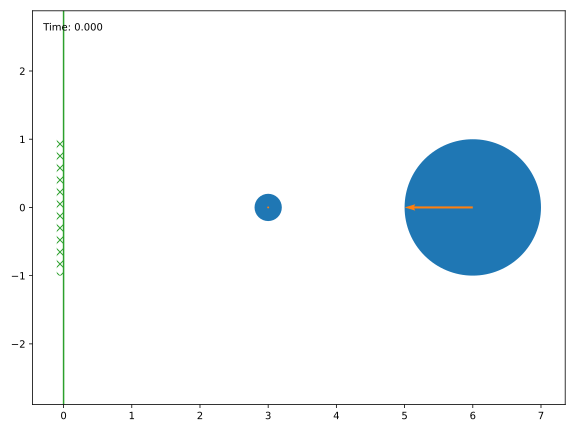
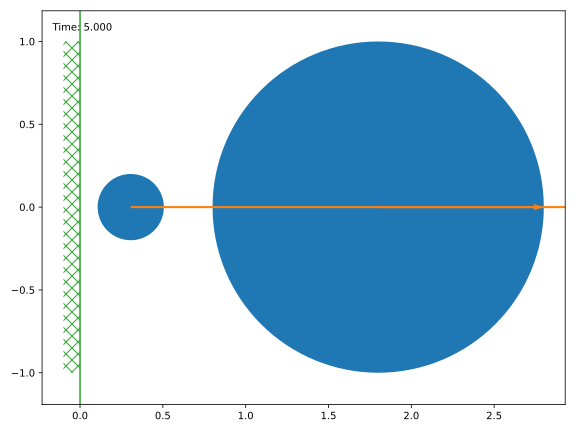
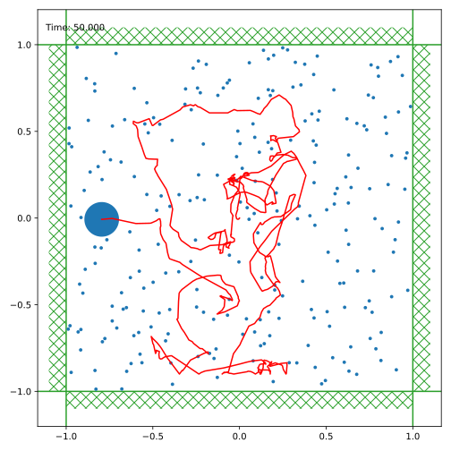

Quickstart
==========

All important classes (the billiard simulation and obstacles) are
accessible from the top-level module. The visualization module must be
imported separately and tries to load *matplotlib*, *tqdm* and *pyglet*.

.. doctest::

   >>> import billiards  # access to Billiard, Disk and InfiniteWall
   >>> from billiards import visualize  # for plot, animate and interact
   >>> import matplotlib.pyplot as plt  # show plots and animations with plt.show()

Computing π with pool
---------------------

Let’s compute the first few digits of π using a billiard simulation
following the setup of Gregory Galperin. We need a billiard table with a
vertical wall and two balls:

.. doctest::

   >>> obstacles = [billiards.InfiniteWall((0, -1), (0, 1), exterior="right")]
   >>> bld = billiards.Billiard(obstacles)
   >>> bld.add_ball((3, 0), (0, 0), radius=0.2, mass=1)  # position, velocity, radius, mass
   0
   >>> bld.add_ball((6, 0), (-1, 0), radius=1, mass=100**5)
   1

Using the *visualize* module, let’s see how this initial state looks like:

.. doctest::

   >>> visualize.plot(bld)
   <Figure size 800x600 with 1 Axes>
   >>> plt.show()

   Initial state of Galperin’s billiard

The *Billiard.evolve* method simulates our billiard system from
*bld.time* until a given end time. It returns a list of collisions
(ball-ball and ball-obstacle collisions).

.. doctest::

   >>> bld.next_collision  # (time, ball index, ball index or obstacle)-triplet
   (1.8000000000000005, 0, 1)
   >>> total_collisions = 0
   >>> for i in [1, 2, 3, 4, 5]:
   ...     total_collisions += sum(bld.evolve(i))
   ...     print(f"Until t = {bld.time}: {total_collisions} collisions")
   ...
   Until t = 1: 0 collisions
   Until t = 2: 1 collisions
   Until t = 3: 1 collisions
   Until t = 4: 4 collisions
   Until t = 5: 314152 collisions

The first collision happened at time t = 1.8. Until t = 4 there were
only 4 collisions, but then between t = 4 and t = 5 there were several
thousands. Let’s see how the situation looks now:

.. doctest::

   >>> bld.time  # current time
   5
   >>> visualize.plot(bld)
   <Figure size 800x600 with 1 Axes>
   >>> plt.show()

   State at time t = 5

Let’s advance the simulation to t = 16. As we can check, there won’t be
any other collisions after this time:

.. doctest::

   >>> total_collisions += sum(bld.evolve(16))
   >>> bld.balls_velocity  # nx2 numpy array where n is the number of balls
   array([[0.73463055, 0.        ],
          [1.        , 0.        ]])
   >>> bld.next_ball_ball_collision  # next ball-ball collision
   (inf, -1, 0)
   >>> bld.next_ball_obstacle_collision  # next ball-obstacle collision
   (inf, 0, None)
   >>> visualize.plot(bld)
   <Figure size 800x600 with 1 Axes>
   >>> plt.show()

.. figure:: _images/quickstart_3.svg
   :alt: State at time t = 16

   State at time t = 16

Both balls are moving towards infinity, the smaller ball to slow to
catch the larger one. What is the total number of collisions?

.. doctest::

   >>> total_collisions
   314159
   >>> import math
   >>> math.pi
   3.141592653589793

The first six digits match! For an explanation why this happens, see
Galperin’s paper `Playing pool with π (the number π from a billiard
point of
view) <https://www.maths.tcd.ie/~lebed/Galperin.%20Playing%20pool%20with%20pi.pdf>`__
or the series of youtube videos by
`3Blue1Brown <https://www.youtube.com/channel/UCYO_jab_esuFRV4b17AJtAw>`__
starting with `The most unexpected answer to a counting
puzzle <https://www.youtube.com/watch?v=HEfHFsfGXjs>`__.

Lastly, I want to point out that all collisions were elastic, i.e. they
conserved the kinetic energy (within floating point accuracy):

.. doctest::

   >>> 100**5 * (-1) ** 2 / 2  # kinetic energy = m v^2 / 2 at the beginning
   5000000000.0
   >>> v_squared = (bld.balls_velocity**2).sum(axis=1)
   >>> (bld.balls_mass * v_squared).sum() / 2  # kinetic energy now
   4999999999.989935

Brownian motion
---------------

The billiard table is a square box:

.. doctest::

   >>> obs = [
   ...     billiards.InfiniteWall((-1, -1), (1, -1)),  # bottom side
   ...     billiards.InfiniteWall((1, -1), (1, 1)),  # right side
   ...     billiards.InfiniteWall((1, 1), (-1, 1)),  # top side
   ...     billiards.InfiniteWall((-1, 1), (-1, -1)),  # left side
   ...     billiards.Disk((0, 0), radius=0.5),  # disk in the middle
   ... ]
   >>> bld = billiards.Billiard(obstacles=obs)

Distribute small particles (atoms) uniformly in the square, moving in
random directions but with the same speed:

.. code-block:: pycon

   >>> from math import cos, pi, sin
   >>> from random import uniform
   >>> for i in range(250):
   ...     pos = [uniform(-1, 1), uniform(-1, 1)]
   ...     angle = uniform(0, 2 * pi)
   ...     vel = [cos(angle), sin(angle)]
   ...     bld.add_ball(pos, vel, radius=0.01, mass=1)
   ...

Add a bigger ball (like a dust particle)

.. doctest::

   >>> idx = bld.add_ball((0, 0), (0, 0), radius=0.1, mass=10)

and simulate until t = 50, recording the position of the bigger ball at
each collision (this will take some time)

.. doctest::

   >>> poslist = [bld.balls_position[idx].copy()]  # record initial position
   >>> def record(t, p, u, v, i_o):
   ...     poslist.append(p)
   ...
   >>> bld.evolve(50, ball_callbacks={idx: record})
   (0, 0)
   >>> poslist.append(bld.balls_position[idx].copy())  # record last position

Plot the billiard and overlay the path of the particle

.. doctest::

   >>> fig = visualize.plot(bld, velocity_arrow_factor=0)
   >>> fig.set_size_inches((7, 7))
   >>> ax = fig.gca()
   >>> import numpy as np
   >>> poslist = np.asarray(poslist)
   >>> ax.plot(poslist[:, 0], poslist[:, 1], color="red")
   [<matplotlib.lines.Line2D object at 0x...>]
   >>> plt.show()

   Brownian motion
