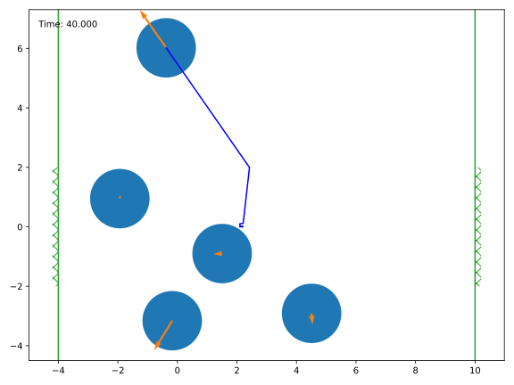

Usage
=====

All important classes (the billiard simulation and obstacles) are
accessible from the top-level module. The visualization module must be
imported separately and tries to load *matplotlib*, *tqdm* and *pyglet*.

.. doctest::

   >>> import billiards  # access to Billiard, Disk and InfiniteWall
   >>> from billiards import visualize  # for plot, animate and interact
   >>> import matplotlib.pyplot as plt  # show plots and animations with plt.show()

The workflow with **billiards** follows three steps:
1. Setup obstacles and create a billiard.
2. Add balls to the billiard.
3. Run the simulation and extract some useful information

As an example of this workflow, let's recreate Newton's cradle.

1. Setup
--------

The complete list of obstacles and their properties is given in
:doc:`api_reference/billiards_obstacles`, all of them can be accessed from the
top-level module. For our billiard, we need two (infinite) walls that we save
in the list ``walls``, then we create a billiard:

.. doctest::

   >>> walls = [
   ...     billiards.InfiniteWall((-4, -2), (-4, 2), exterior="right"),
   ...     billiards.InfiniteWall((10, -2), (10, 2), exterior="left"),
   ... ]
   >>> bld = billiards.Billiard(obstacles=walls)

The ``bld`` object is our main object for billiard simulations, all its methods
are documented in :doc:`api_reference/billiards_simulation`.

2. Add Balls
------------

Using ``bld.add_ball`` we add a row of balls. Only the first one gets a push:

.. doctest::

   >>> bld.add_ball(pos=(-3, 0), vel=(2, 0), radius=1)  # returns index of new ball
   0
   >>> bld.add_ball((0, 0), (0, 0), 1)
   1
   >>> bld.add_ball((2.1, 0), (0, 0), 1)
   2
   >>> bld.add_ball((4.2, 0), (0, 0), 1)
   3
   >>> bld.add_ball((6.3, 0), (0, 0), 1)
   4

An additional parameter is the mass of the balls, here all balls use the
default mass of 1. The mass is important in collisions because heavier balls
impart a bigger impulse on lighter balls. The obstacles that we set up in the
beginning always remain static, as if their mass was infinite.

3. Run the Simulation
---------------------

After adding balls the billiard object already knows the time of the next
collision:

.. doctest::

   >>> bld.next_ball_ball_collision
   (0.5, 0, 1)
   >>> bld.next_ball_obstacle_collision
   (6.0, 0, <billiards.obstacles.InfiniteWall object at 0x...>)
   >>> bld.next_collision  # the minimum of the two above
   (0.5, 0, 1)

These triplets are the time of collision, the index of a ball and, depending on
the type of collision, the index of another ball or an obstacle.

Using ``bld.evolve`` we can simulate the billiard system from the initial time
``bld.time = 0`` until a given end time. Additionally, we extract some
information about the time of collisions.

.. doctest::

   >>> def print_time(t):
   ...     print(f"Collision at t = {t:.3}")
   ...
   >>> bld.evolve(end_time=4, time_callback=print_time)
   Collision at t = 0.5
   Collision at t = 0.55
   Collision at t = 0.6
   Collision at t = 0.65
   Collision at t = 2.0
   Collision at t = 3.35
   Collision at t = 3.4
   Collision at t = 3.45
   Collision at t = 3.5
   Collision at t = 4.0
   (8, 2)

The return value of ``evolve`` is a pair of integers: the number of ball-ball
and ball-obstacle collisions.

Using the *visualize* module, we can also animate the cradle for the next eight
seconds:

.. doctest::

   >>> bld.time
   4
   >>> visualize.animate(bld, end_time=12)
   <matplotlib.animation.FuncAnimation object at 0x...>
   >>> plt.show()

.. raw:: html

    <video width="100%" height="auto" controls>
    <source src="_static/newtons_cradle.mp4" type="video/mp4">
    Your browser does not support the video tag.
    </video>

Just for fun, let's mess up the billiard. We shift the middle ball (the one
with index = 2) slightly upwards. And because modifying a ball can change its
time of collision with the other balls, we have to recompute part of the
internal time-of-impact table.

.. doctest::

   >>> bld.balls_position[2, 1] = 1e-10
   >>> bld.recompute_toi(indices=2)

This imperceptible shift will eventually ruin our cradle. Using another
callback we can record the trajectory of this ball and then plot it.

.. doctest::

   >>> poslist = []
   >>> def record(t, pos, vel_old, vel_new, idx_or_obs):
   ...     poslist.append(pos)
   ...
   >>> bld.evolve(end_time=30, ball_callbacks={2: record})
   (36, 8)
   >>> poslist.append(bld.balls_position[2].copy())  # add last position
   >>> fig = visualize.plot(bld)  # state of the billiard right now
   >>> x = [pos[0] for pos in poslist]
   >>> y = [pos[1] for pos in poslist]
   >>> fig.gca().plot(x, y, color="blue")  # overlay trajectory
   [<matplotlib.lines.Line2D object at 0x...>]
   >>> plt.show()

